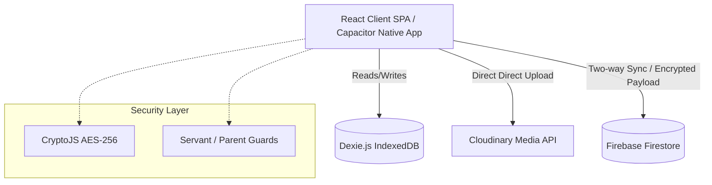
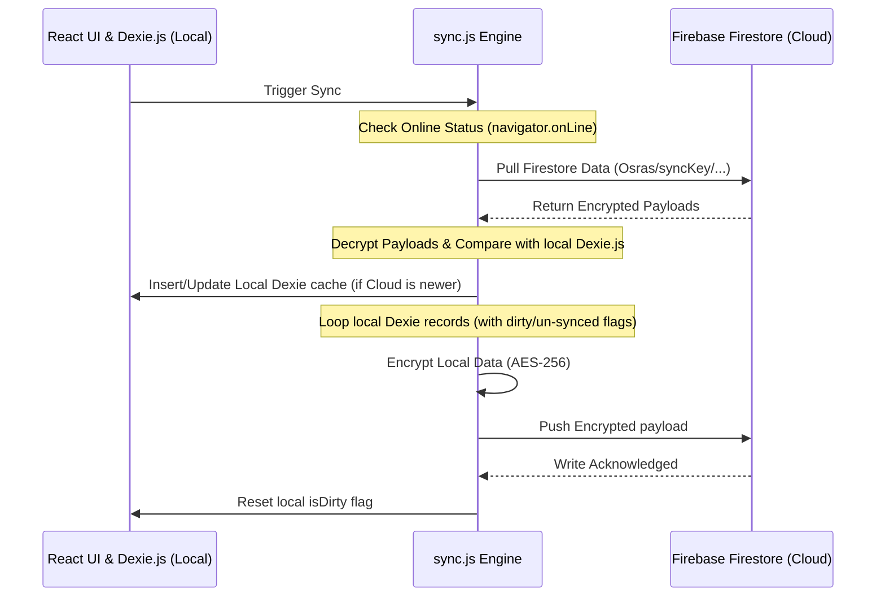

# Premium Coptic Orthodox Deacons Service Application
## System Architecture & Technical Documentation

---

## 1. System Overview & Architecture

The **Premium Coptic Orthodox Deacons Service Application** (Khedmety System) is a high-performance, offline-first web and mobile application designed to streamline deacon class management, attendance tracking, visitation coordination, exams/grades recording, and audio curriculum distribution. 

The application is structured around a role-based, multi-tenant architecture designed to support Coptic Orthodox service groups (known as **Osras**) operating within larger services (**Khedmas**).

### Core Tech Stack
*   **Frontend Library:** React (18+) with Vite as the build tool.
*   **Database (Cloud):** Firebase Firestore (NoSQL) for real-time document synchronization.
*   **Database (Offline Cache):** Dexie.js (wrapper around browser IndexedDB) acting as the local offline-first database.
*   **Styling & UI:** Vanilla CSS combined with Tailwind CSS utilities. Icons provided by `lucide-react`.
*   **Media & Storage hosting:** Cloudinary for media assets (images, curriculum PDFs, and audio files).
*   **App Packaging:** Capacitor for packaging the web app into a native Android/iOS container (utilizing native APIs such as local notifications and network status listeners).
*   **Encryption:** Client-side cryptography using `crypto-js` (AES-256) to ensure zero-knowledge data isolation.

### High-Level Architecture Diagram


---

## 2. Security & Multi-Tenancy (Data Isolation)

Multi-tenancy and data isolation are critical pillars of this system. Due to the sensitive nature of student/deacon records (phone numbers, addresses, attendance logs, and exam marks), the system implements a strict partitioning strategy combined with client-side cryptography.

### 2.1 The Role of `syncKey` (Class/Osra Isolation)
Each deacon class or youth group (Osra) is assigned a unique `syncKey` (a cloud partition key). 
1.  **Local Isolation:** In Dexie.js, the local database indexes tables (`children`, `attendance`, `events`, `grades`, `hymns`) on the `syncKey` field. When a servant is logged into the application, queries are strictly constrained to their active partition key:
    ```javascript
    db.children.where('syncKey').equals(currentSyncKey).toArray();
    ```
2.  **Cloud Isolation:** In Firestore, documents are structured under hierarchical paths segregated by the `syncKey`:
    *   `/Osras/{syncKey}/children/{childId}`
    *   `/Osras/{syncKey}/attendance/{attendanceId}`
    *   `/Osras/{syncKey}/exams/{examId}/grades/{childId}`
    *   `/Osras/{syncKey}/hymns/{hymnId}`

### 2.2 Client-Side End-to-End Encryption (Zero-Knowledge Architecture)
To prevent unauthorized access to personal identifiable information (PII) at the cloud database level:
*   Before any deacon, attendance, or exam record is sent to Firestore, it is sanitized, serialized, and encrypted on the client side using **AES-256 encryption** (`crypto-js`) with a shared secret key (`VITE_ENCRYPTION_SECRET`).
*   The payload uploaded to Firestore consists of a single `{ payload: encryptedString }` field.
*   When syncing or loading data, the application pulls the encrypted payload and decrypts it on the client device. This guarantees that Coptic Orthodox servant/admin/deacon data remains unreadable to anyone accessing the Firestore console directly without the encryption key.

### 2.3 `childId` Scoping in Parent Flows
To prevent data leakage between parents:
*   Parent accounts do not use passwords. Instead, they authenticate by selecting their child's Class (Osra) and entering their registered phone number (matched against the decrypted child, mother, or father phone number).
*   Upon matching, the system stores `parentChildId`, `parentSyncKey`, and `parentClassName` in `localStorage`.
*   Real-time listeners (`onSnapshot`) on the parent dashboard are restricted to the authenticated student's documents. The parent dashboard:
    *   Subscribes directly to the child's single document: `/Osras/{parentSyncKey}/children/{parentChildId}`.
    *   Subscribes to `/Osras/{parentSyncKey}/attendance` but filters documents locally to ensure only records containing `childId === parentChildId` are rendered.
    *   Subscribes to specific grades pointing directly to `/Osras/{parentSyncKey}/exams/{examId}/grades/{parentChildId}`.
This architecture prevents parents from querying or viewing any records belonging to other deacons.

### 2.4 Authentication and Routing Guards
Navigation routing is protected by functional wrappers in [App.jsx](file:///d:/5dmaty/kids-service-app/src/App.jsx):
*   **Servant Guard (`ServantProtectedRoute`):** Verifies that `currentSyncKey` exists in the local storage. If missing, it blocks view renders and navigates to `/login`.
*   **Parent Guard (`ParentProtectedRoute`):** Verifies that `parentChildId` is set in the local storage. If missing, it blocks view renders and navigates to `/parent-login`.

---

## 3. Screen-by-Screen Feature Breakdown

### 3.1 Servant Flow

#### `Home.jsx` (Home Page)
The primary cockpit for class servants. Key features include:
*   **Attendance Logging Quick Actions:** Interactive panels to record who attended the liturgical service (`liturgy`) or the class lesson (`service`).
*   **Liturgical/Coptic Calendars:** Integrates standard Gregorian date conversion alongside the traditional Coptic calendar months and days (e.g. Tut, Baba, Hator) for ecclesiastical planning.
*   **Dynamic Birthday Tracking:** Automatically scans the deacons database to list active birthdays for the current Gregorian month, prompting servants to arrange rewards.
*   **Smart Attendance Radar:** 
    *   *Absent Follow-up:* Generates pre-filled, gender-responsive WhatsApp template messages (distinguishing pronouns for boys and girls) to send to parents, including direct click-to-chat links with default text: *"وحشتنا يا بطلنا... مجتش ليه الجمعة اللي فاتت؟"*
    *   *Visitation Warnings:* Displays deacons who have not attended service or liturgy for 21 consecutive days (or have an attendance streak of 0), flagging them as "in need of visitation."
    *   *Champions List:* Lists the top 15 deacons with the longest consecutive attendance streaks (`streak`) to foster healthy motivation.
*   **Central Cloud Sync Button:** Visually alerts servants if there is local un-synchronized data (flashing red sync icon) and executes bi-directional synchronization on demand.

#### `ExamsManager.jsx` (Exams Manager)
Allows class servants to manage academic assessments and deacon performance tracking.
*   **Exam Creation:** Servants specify an exam name (e.g. *Liturgy Response Oral*, *Half-Year Written Hymns*) and a final grade scale (maximum marks).
*   **Batch Grading Grid:** Renders all deacons registered under the servant's class. Servants can enter grades directly inside inputs. Changes are saved immediately and synchronized with Firestore.
*   **Real-time Synchronization:** Installs a live Firestore listener (`onSnapshot`) to listen for newly created exams and grades, ensuring concurrent servants working on the same class see live updates.

#### `Dashboard.jsx` (Servant Analytics & Media Panel)
A screen containing four sub-views:
*   **Advanced Analytics:** Displays total class strength, gender distribution, and graphical bar charts representing liturgy vs. class attendance throughout the Fridays of the current month.
*   **Visitations Timeline:** Renders a vertical history log of home visitations conducted, grouped by dates.
*   **Excel Exporter & Database Utilities:**
    *   *Tansyq Export:* Generates and downloads fully styled Microsoft Excel spreadsheets using `xlsx` containing deacon details (names, parent phone numbers, addresses, total attendance counts, and specific notes). Filtering options exist for *All*, *Boys Only*, or *Girls Only*.
    *   *Tasefer/Reset Counters:* Allows resetting deacons' active attendance streaks and dates at the beginning of each Coptic month.
    *   *Nuclear Clean Slate:* A protected developer tool to clean local databases, requiring a secure password confirmation.
*   **Hymns Library Manager (Cloudinary integration):**
    *   Servants write down the hymn name and select an audio file (MP3/WAV/etc.).
    *   The file is uploaded directly to Cloudinary. Once the Cloudinary upload returns success, the returned URL is encrypted and stored in Firestore under `/Osras/{syncKey}/hymns`.

---

### 3.2 Admin Flow

#### `SystemAdmin.jsx` (Central Control Panel)
Restricted to the Priest (Abouna), General Service Coordinator (Amin Khedma), or System Administrators.
*   **Two-Way Smart Structure Sync:** Merges local and cloud configurations. It prevents concurrent modifications by different admins from overwriting one another by merging lists based on IDs (for services/classes) and phone numbers (for servants).
*   **Church Hierarchy Setup:** Admins can visually construct the ecclesiastical structure of the church, adding *Services* (e.g. Primary Service, Prep School Deacons) and nesting *Osras* (classes) within them.
*   **Class Cloud Keys (`syncKey`) Allocation:** Admins generate and assign the partition keys for each class. These keys are used to configure servant devices.
*   **Curriculum PDF Assignment:** Allows uploading or pasting a link to class curriculum PDFs. The file input uploads directly to Cloudinary and links the secure URL to the class settings. Deacons can subsequently read this curriculum using the built-in [PdfViewer.jsx](file:///d:/5dmaty/kids-service-app/src/pages/PdfViewer.jsx).
*   **Servant Approvals & Credentials Distribution:**
    *   Renders registration requests submitted via the SignUp screen. Admins approve requests to automatically create credentials and assign sync keys.
    *   Provides a quick WhatsApp action to transmit credentials (username/phone and cloud partition key) to newly approved servants.

---

### 3.3 Parent Flow

#### `ParentLogin.jsx` (Parent Authentication Gateway)
*   **Passwordless Security:** Rather than relying on traditional passwords, parents choose their child's class and enter their mobile number.
*   **Decrypted Phone Lookup:** The system fetches all deacons under the selected class, decrypts their data, and matches the entered number against:
    *   Deacon's personal phone number.
    *   Mother's mobile number.
    *   Father's mobile number.
*   **Offline Cached Login:** Upon validation, the child's profile and attendance log are cached locally into Dexie.js, allowing the parent dashboard to work offline.

#### `ParentDashboard.jsx` (Student Performance Monitor)
*   **Real-time Info Listener:** Mounts an active listener to the child's document to instantly display streak updates, liturgy attendances, and special coordinator notes.
*   **Liturgy & Service Attendance Metrics:** Shows visual progress cards highlighting exactly how many service meetings and liturgies the deacon attended.
*   **Assessment Grades List:** Displays grades received by the deacon alongside the maximum achievable mark for each exam.
*   **Live Audio Player:** Lists all hymns uploaded by the servant for this specific class. Parents can stream audio files directly using an integrated HTML5 player.

---

## 4. Data Flow & Sync Mechanisms



### 4.1 Offline-First Sync Architecture (`sync.js`)
The application is designed to operate in areas with poor internet connection (such as church basements). 
1.  **Local Storage Operations:** When servants log attendance, create events, or write notes, the application immediately updates Dexie.js (IndexedDB). The records are flagged with `isDirty: true` or `synced: 0`.
2.  **Network Reconnect Event:** The application leverages Capacitor's Network plugin to monitor connection status. If a servant works offline and then reconnects to internet, the app triggers a Capacitor local notification warning them to sync: *"عندك داتا وملاحظات متسجلة أوفلاين، افتح الأبلكيشن واعمل مزامنة"*.
3.  **Sync Execution Pipeline:**
    *   **Settings Sync:** Fetches the central church structural configurations (`System/mainConfig`) and saves it locally.
    *   **Pull Phase:** Pulls the class documents for `children`, `attendance`, and `events`. Decrypts the payloads, converts them to maps, and runs a deep equality check (`isDataChanged`) against Dexie. Local databases are updated with new/updated cloud records.
    *   **Push Phase:** Iterates through local Dexie arrays. Any record marked dirty is encrypted and set in Firestore at its exact document reference (merging fields). Once successful, the local record is marked clean.

---

## 5. External Integrations

### 5.1 Cloudinary Upload Pipeline
Cloudinary is used to host images (deacon profile pictures), class booklets (Curriculum PDFs), and hymns (audio files).

1.  **Client-to-Cloud Upload:** Files are uploaded directly from the client application using unsigned uploads to bypass the need for server-side signing tokens.
2.  **API Call:**
    *   Endpoint: `https://api.cloudinary.com/v1_1/dtpgtck7u/upload`
    *   Upload Preset: `khedmety`
    *   Cloud Name: `dtpgtck7u`
3.  **Metadata Sync:** Cloudinary returns a secure HTTPS URL (e.g. `https://res.cloudinary.com/dtpgtck7u/video/upload/...mp3`). The application captures this URL, encrypts it within the payload, and saves it to Firestore.

### 5.2 Firebase Configuration
The system relies on Firestore as the primary real-time database and Firebase Hosting/Vercel for deployment. Firebase App Check (utilizing ReCaptcha V3) is pre-configured for production environments to safeguard API endpoints.

---

## 6. Deployment & Maintenance

### 6.1 Required Environment Variables
A `.env` file must be configured in the project root:
```env
# Client-side encryption key for CryptoJS (AES-256)
VITE_ENCRYPTION_SECRET=Your_Super_Secret_Encryption_Key_Here
```

### 6.2 External API Configuration Key Reference
The Firebase credentials are bound in [firebase.js](file:///d:/5dmaty/kids-service-app/src/db/firebase.js):
*   **Project ID:** `khedmety-app-ff980`
*   **App ID:** `1:254793483380:web:012b50367c2978215b7d21`
*   **Measurement ID:** `G-5QMZ75G38W`

Cloudinary configuration:
*   **Cloud Name:** `dtpgtck7u`
*   **Upload Preset:** `khedmety`

### 6.3 Build & Deployment Steps

#### Web Application (Vercel)
To compile the web application for production:
1.  Install dependencies:
    ```bash
    npm install
    ```
2.  Build the production bundle:
    ```bash
    npm run build
    ```
3.  Deploy to Vercel (using the defined `vercel.json` rewrite routing rules to prevent 404s on route refresh):
    ```bash
    vercel --prod
    ```

#### Mobile Application (Android/Capacitor)
To sync web build output and compile the native Android package:
1.  Build the React project:
    ```bash
    npm run build
    ```
2.  Sync assets with Capacitor:
    ```bash
    npx cap sync
    ```
3.  Open the project in Android Studio to build the release APK (`khedmety-key.jks` signing key is located in the root directory):
    ```bash
    npx cap open android
    ```
